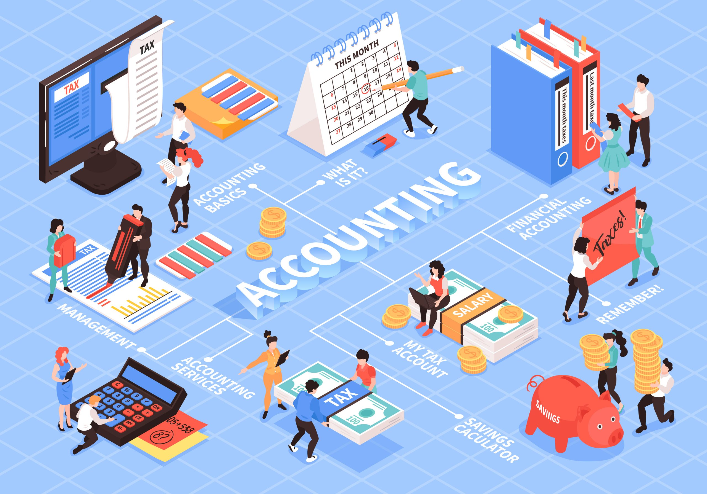
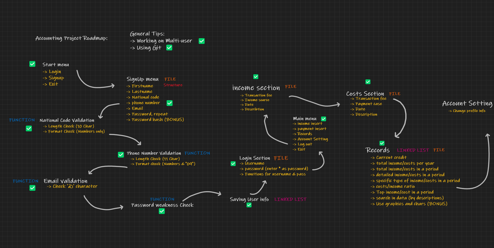

# Accounting

This is my first project at University and we are supposed to create a console application in `C` for a simple student to manage his/her budget.

## Some Details You may want to know

Start Menu maybe like:

- Login
- Sign Up
- Exit

and in `Sign Up` it wants you to register your personal details and it will take your Phone Number as your username.

 > Phone Numbers in my country start with "09" and the national id has 10 numbers only. so you may have some problem using my app in another country (I'm sorry :))

This app is kinda a multi-user one so after `Login`, you will be able to `Record Incomes`, `Record Expenses`, and view `Statistics`. 

- Main Menu
    - Record Income
    - Record Expense
    - Statistics
    - Account setting 

> `Account Setting` was supposed to change user's profile data but working with files was so hard so I decided to Skip that (part of score go bye-bye) 

 Statistics is the main part of this project and in this app, I tried to implement some useful functions

- Statistics
    - Current Credit
    - Detailed Income / Expense
    - Total Income / Expense In a Year (and in a period)
    - Transactions Ratio
    - Search
    
 > Actually we were supposed to implement the `Statistics` using, `Linked List` but it was kinda hard so I took the short and easier way (Sorry prof. Taheri :))

 That's all about this project, it took about 23 days non-stop, non-sleeping, demanding work and I may need some chilling after this. (Just exaggerating it wasn't that hard)

 I also design a beautiful roadmap which I want to be uploaded here:

 and that's that. I may work on some updates later...
